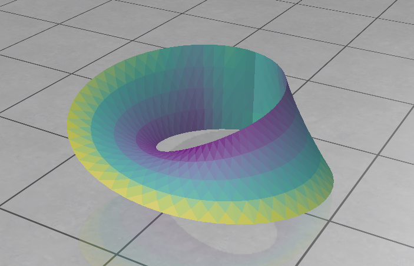
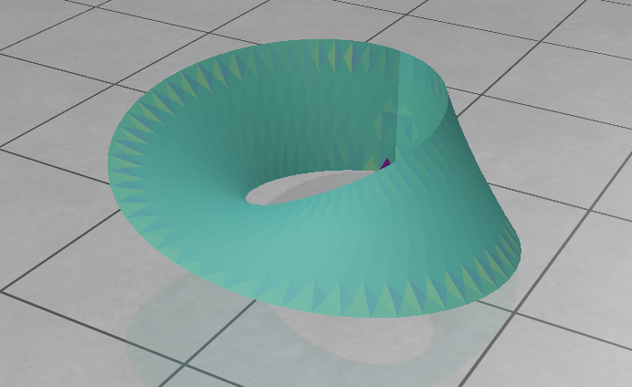
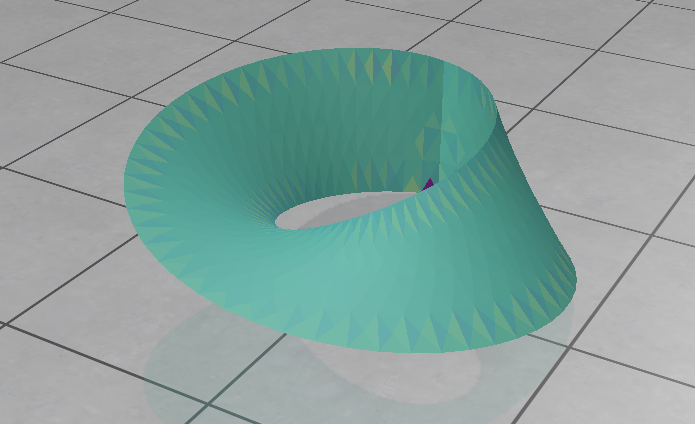
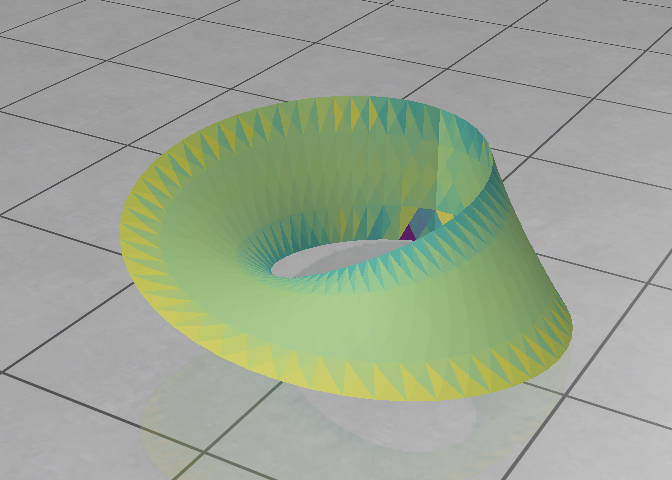
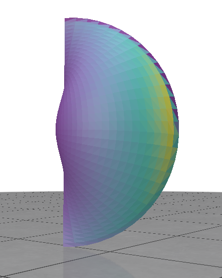
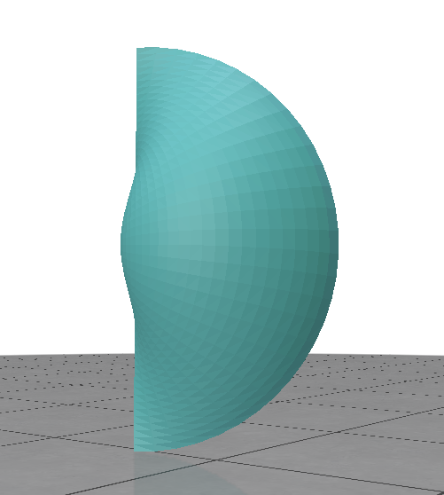
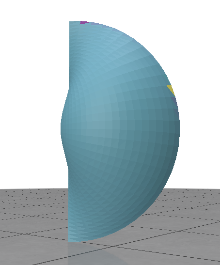
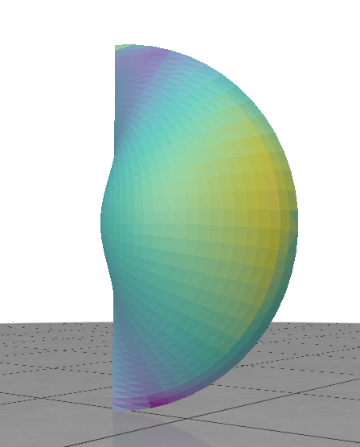

# Recherche sur le document "Interpolated corrected curvature measures for polygonal surfaces"

_Par J-O. Lachaud, P. Romon, B. Thibert et D. Coeurjolly_

Le fichier main permet de lancer une visualisation des différents Mesh et des mesures de courbures.

## Commment lancer le projet:

Les quelques lignes de commandes si dessous permettent de cloner et mettre en place le projet.

```
    git clone https://github.com/Poutchy/PROJ_601.git
    cd PROJ_601
    pip install -r requirements.txt
```

## Lancer le programme

Il vous est possible d'ajouter des mechs dans le dossier correspondant. Pour choisir le mech à utiliser dans la simulation, vous devez prendre le nom du mesh, et le saisir dans l'invite de commande de cette manière:

```
    python main.py <nom_du_mesh>
```

## Résultats observés

On peut observer sur les images que les courbures se dessines parfois mal bien à cause de bruit provenant de quelques faces dont la courbure est significativement plus importante que les autres.

Ce bruit est atténué à l'aide du changement des calculs en utilisant les faces adajcentes des meshs.

## Exemples de résultats:

### Moebius

**Area density for the mesh Moebius**


**Gaussian density for the mesh Moebius**


**Corrected curvature mesures for the mesh Moebius**


**Corrected curvature measurs extended to a circle for the mesh Moebius**


### Snail

**Area density for the mesh Snail**



**Gaussian density for the mesh Snail**



**Corrected curvature mesures for the mesh Snail**



**Corrected curvature measurs extended to a circle for the mesh Snail**


